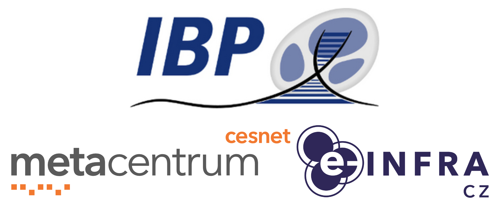

# **Hands-on course, Institute of Biophysics of the Czech Academy of Sciences, November 2023, Brno**

This readme was created by Jiří Vorel (vorel@cesnet.cz).

Jiří Vorel and Roman Leontovyč lectured the course.

Information given in this course is current as of 30th November 2023.

<p align="center"></p>

# Table of contents
* [Introduction](#introduction)
  * [Aims](#aims)
  * [Prerequisites](#prerequisites)
  * [Dedicated resources](#dedicated-resources)
  * [Data and tools](#data-and-tools)
  * [Useful links](#useful-links)
* [Log in to the frontend server](#log-in-to-the-frontend-server)
* [Basic orientation in your home directory](#basic-orientation-in-your-home-directory)

# Introduction

## Aims

This tutorial, in the brief form of a hands-on course, shows how to process and analyse sequencing data using [MetaCentrum NGI](https://www.metacentrum.cz/en/index.html) (National Grid Infrastructure). Participants will be introduced to the basic usage of MetaCentrum, e.g. how to [log in to the frontend server](https://docs.metacentrum.cz/access/log-in/), how to [manipulate data](https://docs.metacentrum.cz/data/data-within/) properly, how to [start an interactive or batch job](https://docs.metacentrum.cz/basics/jobs/), and how to [display graphical output](https://docs.metacentrum.cz/software/graphical-access/).

In the practical part of the course, we will use publicly available sequencing data (produced by [Illumina](https://www.illumina.com/) and [Oxford Nanopore](https://nanoporetech.com/) platforms) for the _de novo_ hybrid assembly of the bacterial genome - specifically, _Escherichia coli_ strain A0 34/86 (as described in this [paper](https://journals.asm.org/doi/10.1128/mra.00363-23)). Unfortunatelly, processing raw reads, genome assembly and following gene prediction and annotation are processes (especially in the case of larger eukaryotic genomes) that often require time-consuming tuning for optimal parameters and considerable hardware resources.

> [!IMPORTANT]  
> **This course does not aim to create a perfect genome assembly.**
> 
> Due to the time limitation of this course and its primary focus (how to use grid infrastructure as effectively as possible), we will create a very rough genome draft using a few necessary steps.
>
> The proposal of a comprehensive approach for a "perfect" bacterial genome assembly can be seen [here](https://journals.plos.org/ploscompbiol/article?id=10.1371/journal.pcbi.1010905).

> [!NOTE]
> Throughout this tutorial, important points are supplemented with links to documentation with more detailed descriptions and explanations.

## Prerequisites

To get the full potential of this course, each of the participants should be (or should have):
  -  **be a registered user of MetaCentrum** (due to the process involving application approval and propagation of a new account, it is necessary to apply for an account no later than a day before the course).
  -  **know login information - username and password** (created during the application process).
  -  **have a laptop with a working internet connection.**
  -  **be able to log in to the remote server (via SSH protocol).**
  
> [!NOTE]
> This course is designed for participants with no command-line (CLI) knowledge. But this knowledge is recommended. All commands and shell scripts used during the course are pasted below and can be directly copied.

> [!NOTE]
> No data and software tools need to be downloaded or installed before the course. Data will be downloaded during the course, and all software tools (freely available for non-commercial usage) are already available for MetaCentrum users. 

## Dedicated resources

As is typical for grid computing, all submitted jobs are sorted into specific [queues](https://docs.metacentrum.cz/advanced/queues-in-meta/) (mainly based on the amount of requested resources). The combination of the required resources and the current infrastructure load determines the delay between the job submission and the start of the calculation. Very demanding jobs can wait in the queue for several days before all the required resources are free. We will use a special queue `XYZ` reserved only for this course to avoid this delay. This queue employs two ida machines (`ida7` and `ida25`), each with 20 CPU cores and 128 GB RAM.

> [!IMPORTANT]  
> Each job submitted during this course needs to target this dedicated queue. As you will see later, interactive jobs will include a parameter `-q XYZ`, and batch jobs will include the line `#PBS -q XYZ`. In both cases, the job scheduler [PBSPro](https://docs.metacentrum.cz/basics/concepts/#pbs-servers) will send jobs to this specified queue.

## Data and tools

The following data and software tools will be used during the course:

 - Illumina paired-end reads (NCBI SRA accession number: [SRX20115911](https://www.ncbi.nlm.nih.gov/sra/SRX20115911[accn])).
 - Oxford Nanopore reads (NCBI SRA accession number: [SRX20115912](https://www.ncbi.nlm.nih.gov/sra/SRX20115912[accn])).
 - [NCBI SRA Toolkit](https://github.com/ncbi/sra-tools) for downloading sequencing data.
 - 

## Useful links
 - [MetaCentrum terms and conditions](https://docs.metacentrum.cz/access/terms/)

> [!NOTE]
> Access to MetaCentrum is granted free of charge only to members (employees and students) of academic/research institutions of the Czech Republic.
   
 - [Documentation](https://docs.metacentrum.cz/)
 - [Monitoring page](https://metavo.metacentrum.cz/en/index.html)
 - [User support contact](https://docs.metacentrum.cz/contact/)
 - MetaCentrum is an activity of the [CESNET](https://www.cesnet.cz/?lang=en) association, part of the [e-INFRA CZ](https://www.e-infra.cz/en) - research and development e-infrastructure.

# Log in to the frontend server

Like most computing/data centres, MetaCentrum nodes run exclusively on Linux (mainly [Debian](https://www.debian.org/)) and are controlled via the command line. Linux is preferred for its stability, security, speed, adaptability, and compatibility. Additionally, software tools for life sciences are primarily designed and optimised for Linux.

We will use one of the login servers known as [frontend](https://docs.metacentrum.cz/basics/concepts/#frontends-storages-homes) for logging in. Frontend servers are accessible via SSH protocol and serve as a main gateway for the entire infrastructure.

> [!WARNING]
> Frontend servers are virtual machines with limited computational power and primarily serve for basic data inspection and manipulation, preparation of the shell scripts for batch jobs, short compilations, etc. Please do not use them for long and/or demanding calculations (rather use an [interactive job](https://docs.metacentrum.cz/basics/jobs/#interactive-job)).

> [!NOTE]
> MetaCentrum can be accessed worldwide. We do not apply any geoblocking.

The following diagram shows the position of the frontend servers (labelled as **Login nodes**) in the context of other parts of the grid infrastructure. 

<p align="center"></p>

In this tutorial, we will use frontend `skirit` with an address `skirit.metacentrum.cz` for logging in. Skirit frontend runs on Debian 11 and has a home directory mounted on the storage `brno2` (accessible as `/storage/brno2/home/user_name/`).

> [!IMPORTANT]  
> MetaCentrum for log in does not fully support traditional authentication with SSH keys. 
> MetaCentum uses the [Kerberos](https://docs.metacentrum.cz/advanced/kerberos/) system for authentication, which requires a **username** and **password**.

> [!TIP]
> You can [install and configure Kerberos](https://docs.metacentrum.cz/advanced/kerberos/#install-kerberos) on your personal computer (available for all operating systems). It allows you to generate a local Kerberos ticket with a lifetime of up to 24 hours and log in to Metacentrum nodes without typing a password for this period.

Windows users can use (for example) an SSH client  Putty (as described [here](https://docs.metacentrum.cz/software/graphical-access/#connect-with-putty-in-windows)).

CLI users can open their terminals and type the following command (**replace `user_name` with your real MetaCentrum username**) and password.

```shell
ssh user_name@skirit.metacentrum.cz
```
> [!NOTE]  
> No characters appear during the password typing in the terminal. This is a standard security behaviour.

> [!IMPORTANT]  
> **Do not share your MetaCentrum password with someone else.** It could be interpreted as violating the terms of use, and your account could be banned.


# Basic orientation in your home directory


