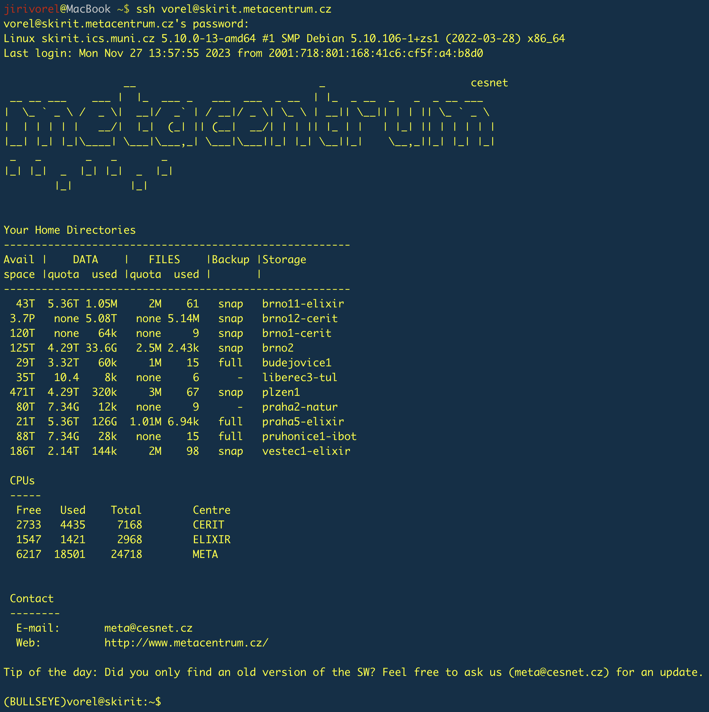

# **Hands-on course, Institute of Biophysics of the Czech Academy of Sciences, November 2023, Brno**

This readme was created by Jiří Vorel (vorel@cesnet.cz).

Jiří Vorel and Roman Leontovyč lectured the course.

Information given in this course is current as of 30th November 2023.

<p align="center"></p>

# Table of contents
* [Introduction](#introduction)
  * [Aims](#aims)
  * [Prerequisites](#prerequisites)
  * [Dedicated resources](#dedicated-resources)
  * [Data and tools](#data-and-tools)
  * [Useful links](#useful-links)
* [Log in to the frontend server](#log-in-to-the-frontend-server)
* [Basic orientation in your home directory](#basic-orientation-in-your-home-directory)
* [System of software modules](#system-of-software-modules)
* [Raw reads and quality control](#raw-reads-and-quality-control)
* [Data manipulation](#data-manipulation)

# Introduction

## Aims

This tutorial, in the brief form of a hands-on course, shows how to process and analyse sequencing data using [MetaCentrum NGI](https://www.metacentrum.cz/en/index.html) (National Grid Infrastructure). Participants will be introduced to the basic usage of MetaCentrum, e.g. how to [log in to the frontend server](https://docs.metacentrum.cz/access/log-in/), how to [manipulate data](https://docs.metacentrum.cz/data/data-within/) properly, how to [start an interactive or batch job](https://docs.metacentrum.cz/computing/run-basic-job/), and how to [display graphical output](https://docs.metacentrum.cz/software/graphical-access/).

In the practical part of the course, we will use publicly available sequencing data (produced by [Illumina](https://www.illumina.com/) and [Oxford Nanopore](https://nanoporetech.com/) platforms) for the _de novo_ hybrid assembly of the bacterial genome - specifically, _Escherichia coli_ strain A0 34/86 (as described in this [paper](https://journals.asm.org/doi/10.1128/mra.00363-23)). Unfortunatelly, processing raw reads, genome assembly and following gene prediction and annotation are processes (especially in the case of larger eukaryotic genomes) that often require time-consuming tuning for optimal parameters and considerable hardware resources.

> [!IMPORTANT]  
> **This course does not aim to create a perfect genome assembly.**
> 
> Due to the time limitation of this course and its primary focus (how to use grid infrastructure as effectively as possible), we will create a very rough genome draft using a few necessary steps.
>
> The proposal of a comprehensive approach for a "perfect" bacterial genome assembly can be seen [here](https://journals.plos.org/ploscompbiol/article?id=10.1371/journal.pcbi.1010905).

> [!NOTE]
> Throughout this tutorial, important points are supplemented with links to documentation with more detailed descriptions and explanations.

## Prerequisites

To get the full potential of this course, each of the participants should be (or should have):
  -  **be a registered user of MetaCentrum** (due to the process involving application approval and propagation of a new account, it is necessary to apply for an account no later than a day before the course).
  -  **know login information - username and password** (created during the application process).
  -  **have a laptop with a working internet connection.**
  -  **be able to log in to the remote server (via SSH protocol).**
  
> [!NOTE]
> This course is designed for participants without command-line (CLI) knowledge. But this knowledge is recommended. All commands and shell scripts used during the course are pasted below and can be directly copied.

> [!NOTE]
> No data and software tools need to be downloaded or installed before the course. Data will be downloaded during the course, and all software tools (freely available for non-commercial usage) are already available for MetaCentrum users. 

## Dedicated resources

As is typical for grid computing, all submitted jobs are sorted into specific [queues](https://docs.metacentrum.cz/computing/queues-in-meta/) (mainly based on the amount of requested resources). The combination of the required resources and the current infrastructure load determines the delay between the job submission and the start of the calculation. Very demanding jobs can wait in the queue for several days before all the required resources are free. We will use a special queue `MetaSeminar` reserved for this course to avoid this delay. This queue employs two ida machines (`ida7` and `ida25`), each with 20 CPU cores and 128 GB RAM.

> [!IMPORTANT]  
> Each job submitted during this course needs to target this dedicated queue. As you will see later, interactive jobs will include a parameter `-q MetaSeminar` and batch jobs will include a line `#PBS -q MetaSeminar`. In both cases, the job scheduler [PBSPro](https://docs.metacentrum.cz/computing/concepts/#pbs-servers) will send jobs to this specified queue.

## Data and tools

The following data and software tools will be used during the course:

 - Illumina paired-end reads (NCBI SRA accession number: [SRX20115911](https://www.ncbi.nlm.nih.gov/sra/SRX20115911[accn])).
 - Oxford Nanopore reads (NCBI SRA accession number: [SRX20115912](https://www.ncbi.nlm.nih.gov/sra/SRX20115912[accn])).
 - [NCBI SRA Toolkit](https://github.com/ncbi/sra-tools) for downloading sequencing data.
 - [FastQC](https://www.bioinformatics.babraham.ac.uk/projects/fastqc/) for quality control of Illumina reads
 - [NanoPlot](https://github.com/wdecoster/NanoPlot) for quality control of Oxford Nanopore reads

## Useful links
 - [MetaCentrum terms and conditions](https://docs.metacentrum.cz/access/terms/)

> [!NOTE]
> Access to MetaCentrum is granted free of charge only to members (employees and students) of academic/research institutions of the Czech Republic.
   
 - [Documentation](https://docs.metacentrum.cz/)
 - [Monitoring page](https://metavo.metacentrum.cz/en/index.html)
 - [User support contact](https://docs.metacentrum.cz/contact/)
 - MetaCentrum is an activity of the [CESNET](https://www.cesnet.cz/?lang=en) association, part of the [e-INFRA CZ](https://www.e-infra.cz/en) - research and development e-infrastructure.

# Log in to the frontend server

Like most computing/data centres, MetaCentrum nodes run exclusively on Linux (mainly [Debian](https://www.debian.org/)) and are controlled via the command line. Linux is preferred for its stability, security, speed, adaptability, and compatibility. Additionally, software tools for life sciences are primarily designed and optimised for Linux.

We will use one of the login servers known as [frontend](https://docs.metacentrum.cz/computing/frontends/) for logging in. Frontend servers are accessible via SSH protocol and serve as a main gateway for the entire infrastructure.

> [!WARNING]
> Frontend servers are virtual machines with limited computational power and primarily serve for basic data inspection and manipulation, preparation of the shell scripts for batch jobs, short compilations, etc. Please do not use them for long and/or demanding calculations (rather, use an [interactive job](https://docs.metacentrum.cz/computing/run-basic-job/#interactive-job)).

> [!NOTE]
> MetaCentrum can be accessed worldwide. We do not apply any geoblocking.

The following diagram shows the frontend servers' position (labelled as **Login nodes**) in the context of other parts of the grid infrastructure. 

<p align="center"></p>

In this tutorial, we will use frontend `nympha` with an address `nympha.metacentrum.cz` for logging in. Nympha frontend runs on Debian 11 and has a home directory mounted on the storage `plzen1` (accessible as `/storage/plzen1/home/$USER/`).

> [!NOTE]  
> Variable USER (`$USER`) is automatically set after log in and contains the real username.

> [!IMPORTANT]  
> MetaCentrum for log in does not fully support traditional authentication with SSH keys. 
> MetaCentum uses the [Kerberos](https://docs.metacentrum.cz/access/kerberos/) system for authentication, which requires a **username** and **password**.

> [!TIP]
> You can [install and configure Kerberos](https://docs.metacentrum.cz/access/kerberos/#install-kerberos) on your personal computer (available for all operating systems). It allows you to generate a local Kerberos ticket with a lifetime of up to 24 hours and log in to Metacentrum nodes without typing a password for this period.

Windows users can use (for example) an SSH client PuTTY (as described [here](https://docs.metacentrum.cz/software/graphical-access/#connect-with-putty-in-windows)). CLI users can open their terminals and type the following command (**replace a string `user_name` with your actual MetaCentrum username**) and then your password.

```shell
ssh user_name@nympha.metacentrum.cz
```
> [!NOTE]  
> No characters appear during the password typing in the terminal. This is a standard security behaviour.

> [!IMPORTANT]
> **Do not share your MetaCentrum password with someone else.** It could be interpreted as violating the terms of use, and your account could be banned.

When you see the overview of your quotas on individual storages, you have been successfully logged in. Expand the following section for comparison. The colour scheme will vary and is a matter of personal terminal settings.

<details>
<summary>Expand the following section to see what a successful login looks like.</summary>
<p align="center"></p>
</details>

# Basic orientation in your home directory

In Metacentrum, we lack the visual interface typical for desktop computers. Instead, we use text commands. The following table shows a few commands for fundamental work with the Linux command line. Most of them we will use further during the course.

> [!TIP]
> There are hundreds of other commands. You can find more comprehensive tutorials related to this topic online — for example, [here](https://www.freecodecamp.org/news/the-linux-commands-handbook/).

| Command | Action |
| ------------- | -------------|
| `pwd` | Shows the current working directory’s path. |
| `ls` | Lists a directory’s content. |
| `ls -lh` | Lists a directory’s content in column and human-readable format. |
| `mkdir` | Creates a new directory. |
| `cat` | Displays the content of a file. |
| `cd` | Changes the working directory. |
| `cp` | Copies files. |
| `cp -r` | Copies files and directories with their content. |
| `head` | Prints first 10 lines. |
| `mv` | Moves or renames files and directories. |
| `rm` | Removes a file. |
| `rmdir` | Removes an empty directory. |
| `rm -r` | Removes directory with its content. |
| `touch` | Creates a file without content. |
| `.` or `./`  | Refers to the present location. |
| `..` or `../` | Refers to the parent directory. |

After successful log in, you will be (by default) located in your home directory. You can execute the command `pwd` to print an absolute path of your position in the system.

```shell
pwd
```

Your current location determines which files and directories you can see/access/use - which are located at the same position in the system. Execute the command `ls` to see what files and directories are available at this location, i.e., in your home directory.

```shell
ls
```

We can create a new directory named `test_directory`. If you do not like this name, you can choose a different one :wink:

```shell
mkdir test_directory
```

When the folder `test_directory` was created, execute these two commands and compare what was printed in the terminal.

```shell
ls
```
```shell
ls -l
```

> [!NOTE]  
> The terms **folder** and **directory** are interchangeable.

We will also need to edit text files (specifically the shell scripts for the batch jobs). We can use the `touch` command to create an empty file. Let's name this file as `test_file.txt`.

```shell
touch test_file.txt
```

You can execute the `ls` or `ls -lh` command again (depending on your preference) to check whether file `test_file.txt` was created successfully.

<details>
<summary>Expand this section and compare results with me.</summary>
 
```shell
(BULLSEYE)vorel@nympha:~$ ls
test_directory	test_file.txt
(BULLSEYE)vorel@nympha:~$ ls -lh
total 512
drwxr-xr-x 2 vorel meta 4.0K Nov 28 15:21 test_directory
-rw-r--r-- 1 vorel meta    0 Nov 28 15:25 test_file.txt
```
</details>

Let's use the text editor [nano](https://www.nano-editor.org/) to open and further edit the text file `test_file.txt`. 

```shell
nano test_file.txt
```

> [!TIP]
> Use the `tab` key to autocomplete file or folder names. 

> [!NOTE]  
> Metacentrum also offers other editors, such as `vi`, `vim` or `mcedit`. 

You can start typing any text when the `nano` editor is open. When you are done, press the keys `ctrl` and `x` simultaneously. You will be asked if you want to save changes (`Save modified buffer?`). Press `y`, and as we want to overwrite the original file `test_file.txt`, press the `enter` key.

When you want to print the content of the text file in the terminal, try to use the command `cat`.

```shell
cat test_file.txt
```

> [!WARNING]
> The `cat` command prints the entire content of a file in the terminal at once. Therefore, it is not a suitable way to view very long text files. More friendly is the `less` command, which shows the content of a text file by one page (one screen) at a time.

Finally, we can try to rename the file `test_file.txt` to `test_file_renamed.txt` and move it into the  directory `test_directory`.

> [!NOTE]  
> Remember, the `mv` command can rename and move files and folders.

```shell
mv test_file.txt test_file_renamed.txt
```
```shell
mv test_file_renamed.txt test_directory
```

In the last step of this chapter, we can check whether the renamed file `test_file_renamed.txt` was moved to the correct position, and if yes, we can delete folder `test_directory` with its content because we will have no further use for it. 

```shell
ls test_directory
```
```shell
rm -r test_directory
```

# System of software modules 

Software tools available in MetaCentrum are accessible as [environment modules](https://modules.readthedocs.io/en/stable/index.html#). The system of modules is a concept simplifying the use of different software in a precise and controlled manner. Each program (in each version, eventually with additional modifications) is prepared as an individual module that must be activated (loaded) before use. The activation modifies the user's environment and sets everything necessary (especially variables $PATH and $LD_LIBRARY_PATH and loads dependencies) for the program's run.

> [!TIP]
> How to work with MetaCentrum modules is described in detail [here](https://docs.metacentrum.cz/software/modules/).

> [!NOTE]  
> MetaCentrum provides a few thousand modules. With this number of modules, manual control is no longer possible, and sometimes, not everything works without problems. If you encounter any malfunction, please let us know at meta@cesnet.cz.

We can execute a few commands and discuss how the module system works. Let's try to load a module for [BLAST+](https://blast.ncbi.nlm.nih.gov/doc/blast-help/downloadblastdata.html#downloadblastdata).

```shell
module ava blast
```
```shell
module ava *blast*
```
```shell
module ava blast-plus/
```
```shell
module add blast-plus/2.12.0-gcc
```
```shell
module list
```
```shell
module rm blast-plus
```
```shell
module list
```
> [!WARNING]  
> Remember that each activated module somehow modifies your environment. Loading many modules in one session can lead to conflicts and, as a result, to the non-functionality of some applications. The module that can be in conflict with others can be reliably limited only to defined parts of the job.

```shell
( module add module_name_1
programme ...
)
# After the right-round bracket, the used module is inactive, and all environmental modifications are suppressed.
```

# Raw reads and quality control

We will start this hands-on course by downloading the raw sequencing data from the [NCBI Sequence Read Archive](https://www.ncbi.nlm.nih.gov/sra), followed by a quality check.

The methodology will include:
- starting the interactive job and navigating to the [scratch directory](https://docs.metacentrum.cz/computing/scratch-storages/).
- downloading the raw reads.
- quality control of Illumina and Oxford Nanopore raw reads.
- a visual assessment of produced graphs

> [!IMPORTANT]  
> Scratch storage is a storage for temporary files and processed data of running jobs. This storage should be used only during computations and freed immediately after your job ends. The location of the scratch directory is defined by a system variable `SCRATCHDIR`.

First of all, we will submit an interactive job. The meaning of individual parts of the command is explained below.

```shell
qsub -I -l select=1:ncpus=2:mem=10gb:scratch_local=20gb -l walltime=2:00:00 -q MetaSeminar
```

| Parameter | Action |
| ------------- | -------------|
| `qsub` | Command that submits jobs. |
| `-I` | Declares that	the job	is to be run interactively. |
| `select=1` | Reserves resources on one physical node. |
| `ncpus=2` | Reserves two processors. |
| `mem=10gb` | Reserves 10 GB of RAM. |
| `scratch_local=20gb` | Reserves 20 GB of disk space on scratch. |
| `walltime=2:00:00` | Reserves two hours for the job. |
| `-q MetaSeminar` | Submits job into queue MetaSeminar. |

After starting the job, go to the scratch directory, defined as the variable SCRATCHDIR.

```shell
cd $SCRATCHDIR
```
> [!IMPORTANT]  
> Variable SCRATCHDIR (`$SCRATCHDIR`) is automatically set for each job. Always use the `$SCRATCHDIR`. The real path to the scratch directory is unknown before the start of the job because it contains an assigned job number. For example, `/scratch/user_name/job_123456789.meta-pbs.metacentrum.cz`.

For data download, we will use the **SRA Toolkit (version 3.0.3)**, which is a tool developed by [NCBI](https://www.ncbi.nlm.nih.gov/) for SRA data manipulation. In MetaCentrum, this tool is available as a [Conda environment](https://docs.metacentrum.cz/software/sw-list/conda-modules/).

```shell
module add conda-modules
conda activate sra-tools-3.0.3
fasterq-dump -e 2 -p -x SRR24321377 SRR24321378
```

| Flag | Meaning |
| ------------- | -------------|
| `-e 2` | Uses two threads. |
| `-p` | Shows progress. |
| `-x` | Prints more details. |
| `SRR24321377` | Oxford Nanopore reads. |
| `SRR24321378` | Illumina paired-end reads. |

We can check the content of the scratch directory via the `ls -lh` command. Do not use the `cat` command to explore the content of individual `fastq` files!

We can also print out the first ten lines from each file, check the data visually and count the number of sequences in each file.

```shell
head SRR24321377.fastq
head SRR24321378_*.fastq
for NAME in SRR24321377.fastq SRR24321378_1.fastq SRR24321378_2.fastq; do wc -l $NAME | awk '{print $1/4}'; done
```
And we can rename the downloaded files for better clarity.

```shell
mv SRR24321377.fastq ONT_raw_SRR24321377.fastq
mv SRR24321378_1.fastq Illumina_raw_SRR24321378_1.fastq
mv SRR24321378_2.fastq Illumina_raw_SRR24321378_2.fastq
```
We no longer need activated environment `sra-tools-3.0.3` or module `conda-modules`, so we can deactivate them.

```shell
conda deactivate
module rm conda-modules
```

Let's continue with the **FastQC** utility to check the quality of Illumina raw reads. Try to execute the command `module ava fastqc/`. What is the latest FastQC version installed in MetaCentrum?

> [!IMPORTANT]  
> MetaCentrum users are allowed to [install software tools on their own](https://docs.metacentrum.cz/software/install-software/), preferably in their home directories. We fully support these activities. Our only condition is that there is no violation of the license rights of the given tool or the MetaCentrum terms and conditions.

A newer version of FastQC is available. FastQC is distributed as a set of scripts and Java `jar` files. No compilation is needed. Thus, we will download, extract and use the latest version of FastQC. It is pretty simple, and everyone can make it :blush:

```shell
wget https://www.bioinformatics.babraham.ac.uk/projects/fastqc/fastqc_v0.12.1.zip
unzip fastqc_v0.12.1.zip
ls
ls FastQC/
ls -lh FastQC | grep fastqc
chmod u+x FastQC/fastqc
module add openjdk
FastQC/fastqc -h
FastQC/fastqc -t 2 Illumina_raw_SRR24321378_*
ls -lh
module rm openjdk
```

| Command/flag | Meaning |
| ------------- | -------------|
| `wget` | Downloads files from the web. |
| `unzip` | Extract files from a ZIP archive. |
| `\|` | Combines two commands. |
| `grep` | Searches matching text. |
| `chmod u+x` | Permits the user to execute a file. |
| `openjdk` | Module for open source java. |
| `-t 2` | Uses two threads. |

Statistic graphs produced by FastQC are saved as `html` files, which can be downloaded and opened in a web browser on your local computer. Before proceeding, we will also perform quality control for Oxford Nanopore reads. We will use the NanoPlot tool, which can be installed through a [Mamba](https://github.com/mamba-org/mamba) package manager. In MetaCentrum, it is available as a module called `mambaforge`.

> [!NOTE]  
> [Conda](https://docs.conda.io/en/latest/) and [Mamba](https://github.com/mamba-org/mamba) package managers are very popular tools which allow fast and fully automated installations of various software. Each software is installed in a separate environment to avoid conflicts with other tools. In MetaCentrum, Mamba is preferred over Conda because it is designed to be faster and more efficient. Installations through Mamba are mostly [straightforward and non-problematic](https://docs.metacentrum.cz/software/install-software/#conda-packages).

```shell
module add mambaforge
mamba create -p /storage/plzen1/home/$USER/nanoplot-env -c bioconda nanoplot -y
mamba activate /storage/plzen1/home/$USER/nanoplot-env
NanoPlot --help
NanoPlot -t 2 -o ont_outdir -c red --plots dot --N50 --fastq ONT_raw_SRR24321377.fastq
mamba deactivate && mamba deactivate
```

| Command/flag | Meaning |
| ------------- | -------------|
| `mamba create -p...` | Crates a new environment in a specified location and installs a NanoPlot package from the Bioconda channel. |
| `-y` | Automatically approves every action. |
| `mamba activate` | Activates existing environment. |
| `-t 2` | Uses two threads. |
| `-o` | Sets the name of the directory with results. |
| `-c` | Sets the colour of produced graphs. |
| `--plots` | Specifies the plot style. |
| `--50` | Shows N50 mark. |
| `--fastq` | Input file in a fastq format. |
| `&&` | Executes the second command when the first one ends successfully. |

Finally, we can move results from the scratch directory to the home directory (`/storage/plzen1/home/$USER`) for further examination. 

```shell
cp Illumina_raw_SRR24321378_*.fastq /storage/plzen1/home/$USER
cp ONT_raw_SRR24321377.fastq /storage/plzen1/home/$USER
cp Illumina_raw_SRR24321378_*_fastqc.html /storage/plzen1/home/$USER
cp -r ont_outdir /storage/plzen1/home/$USER
```

We no longer need the remaining content of the scratch directory. So we call the `clean_scratch` utility, which will remove all remaining data, and then we execute the `exit` command to quit the running interactive job.

```shell
clean_scratch
exit
```
> [!IMPORTANT]  
> **Scratch directories are not backed up**! Once data is deleted, it is not possible to restore it.

# Data manipulation


